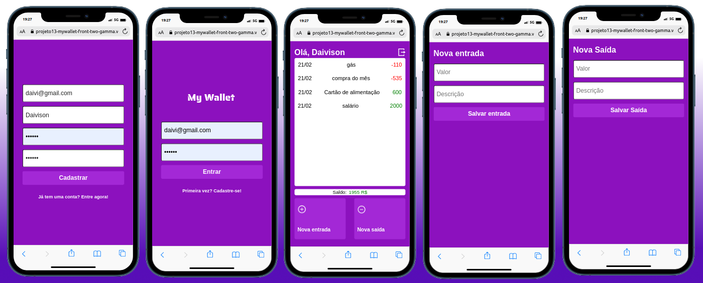

## MyWallet
<h4>  Este projeto fullstack (responsível) é ideal para voçê controlar gastos ou orçamentos, recebendo entradas e saídas de dinheiro, registrando-os e visualizando em tempo real saldos positívos ou negativos.</h4>
 

# Para rodar:

Clone o repositório.

Na raíz do projeto rode: npm run start

No backend, fazer o clone do seguinte repositório https://github.com/Daivison-Morais/projeto13-mywallet-back

## deploy

https://projeto13-mywallet-front-two-gamma.vercel.app/

